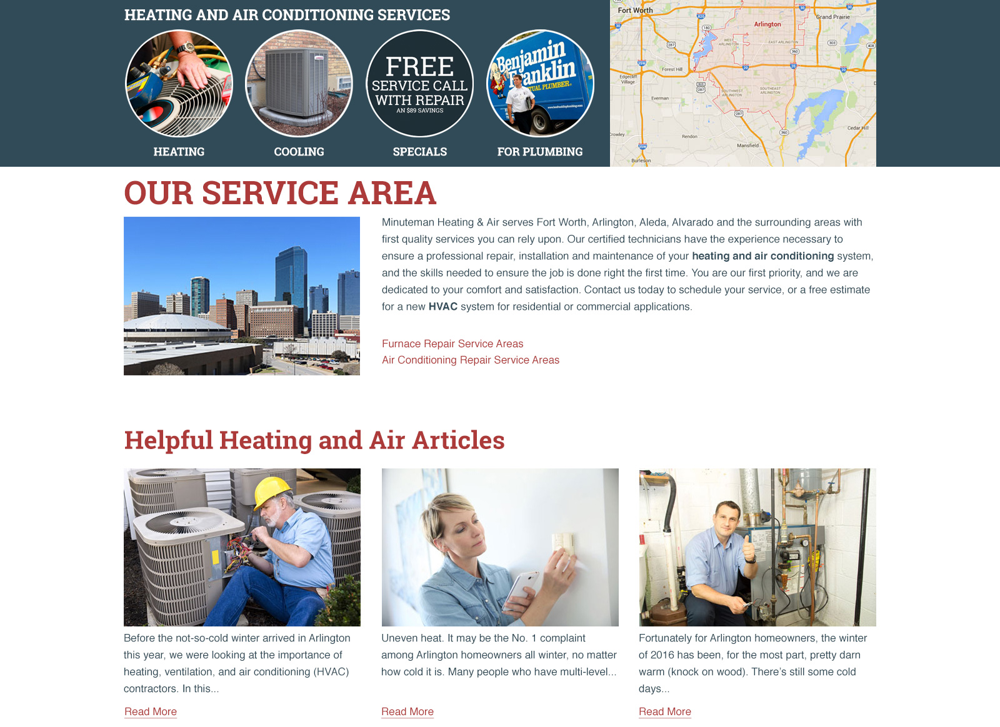
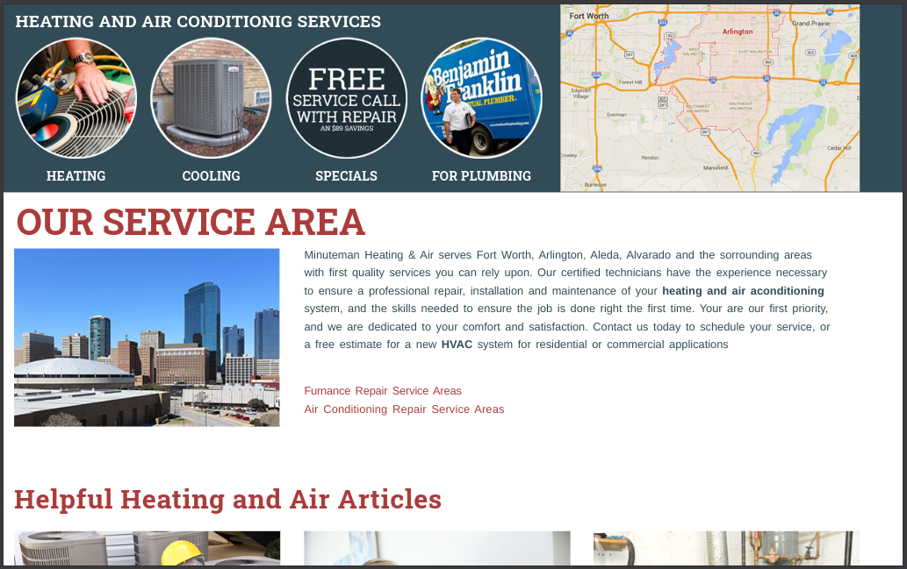
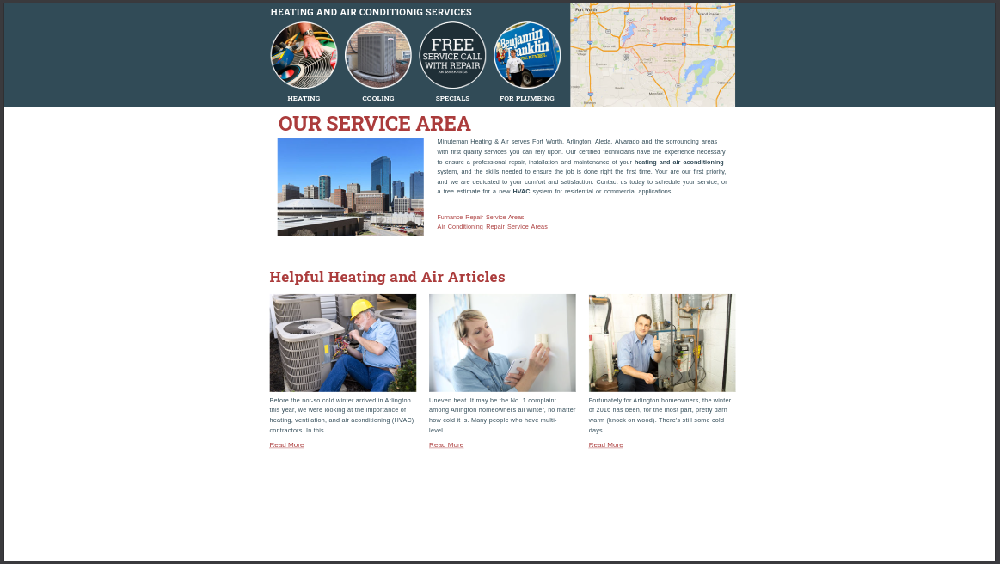

# D.I.A

## Design Implementation Assessment

This a challenge for a WordPress Developer role. In this case I have to build the following design:

**This is the "regular size" of the web:**

**And this is the "wide screen size" design**:

**Colors and Fonts**:

**Red**: #ab3c3c

**Dark Blue/Green**: #314b57

**Heading Font**: Roboto Slab (Google Fonts): https://www.google.com/fonts/specimen/Roboto+Slab

**Paragraph Font**: Helvetica, Arial These are the font

**Some guidelines and some notes**:

* Use only HTML and CSS (no JavaScript or server-side code)
* CSS
  * No CSS frameworks for this exercise (don't use Bootstrap, Foundation, etc.)
  * Please do not use any floats but use flexbox or grid instead
  * We will be looking for near-perfect accuracy
* Fully responsive
  * Smaller screen widths are open to your interpretation of best-practice and what makes sense regarding column stacking, etc. We are looking for smart decisions for fully responsive development.
  * We are often asked to adapt designs to smaller screens without explicit mobile design files being provided
  * The "wider design (2nd image)" should extend for wider screens while what we call the "content frame" has a max width and stays centered.
* The top 4 circular images and their titles are links as well as the map
  * Note: the map is only an image and is not an interactive Google Map
* Links
  * Red paragraph text (not headings) should be links
  * The images under "Helpful Heating and Air Articles” should be links
  * Use href="#" for all links so they style correctly
* Cross browser/device is important and here is a list of what we'll be using to review and what we currently support:
  * Most recent 2 versions of Chrome, Safari, Firefox, Edge
  * iPhone Safari
  * iPad Safari
  * Android Chrome
  * Smallest viewport width supported is 320px (iPhone SE screen width)

**These are some responsive screenshots of the web:**

**The Desktop  Screenshot**:

**And this is the "wide screen size" Screenshot**:

You can visit the page at: https://dia-assesment.vercel.app/

